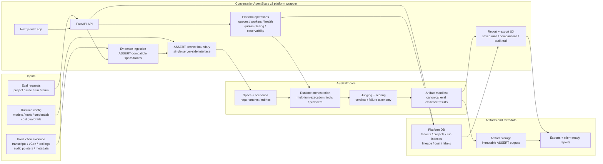

# ConversationAgentEvals

ASSERT-first managed QA and regression testing for voice and conversation agents.

ConversationAgentEvals v2 is the hosted/on-demand platform wrapper around ASSERT. ASSERT owns the canonical eval core: specs, scenarios, runtime orchestration, judging, scoring, failure taxonomy, and portable artifacts. ConversationAgentEvals owns the product wrapper: evidence ingestion, tenant/project/run APIs, platform metadata, queue/worker lifecycle, report UX, exports, and operational deployment.

## First-Run Local Demo

Use this path first. It starts the API, Pipecat service, and web app together and opens the focused benchmark runner. Docker, E2E voice proof, and live ASR paths are advanced follow-ons below.

Prerequisites:

- Node.js 20+
- npm 10+
- Python 3.11+ with `venv` support

Install dependencies:

```bash
npm run setup
```

Create the local environment file:

```bash
cp .env.example .env
npm run check:env
```

The first-run `.env` is intentionally small. Required values are `PORT`, `API_PORT`, `PIPECAT_PORT`, `APP_ENV`, and `PRODUCTION`; the checked-in defaults are enough for the benchmark demo. Optional provider keys, Docker persistence settings, live ASR variables, billing, and auth knobs are documented in [docs/environment.md](docs/environment.md).

Run the local demo stack:

```bash
npm run dev
```

Expected success output:

- The command prints API, Web, and Pipecat URLs.
- If a default port is busy, the command prints the replacement port for that run.
- Open the printed Web URL, then use the benchmark runner at `/benchmarks`.
- Success means benchmark suites load, a scenario can run, and the report shows transcript, action trace, final state, scores, and evidence artifacts.

ASR source for this first run: the minimal local demo uses transcript/action/final-state evidence and does not require live microphone ASR. Live conversation demos use `rtc-asr` as the ASR provider contract; see [docs/environment.md](docs/environment.md#live-asr-and-voice-experiments) for the advanced env values.

## What this repo does

- Wraps ASSERT so hosted users can create projects, suites, runs, reruns, comparisons, exports, and audit views.
- Normalizes production evidence into ASSERT-compatible inputs: transcripts, vCon/call metadata, tool/action traces, final-state snapshots, audio pointers, and related voice metadata.
- Stores ASSERT artifacts/manifests as canonical eval evidence/results while keeping platform metadata and indexes in the app database.
- Records ASSERT provenance for every v2 run: ASSERT version/commit, adapter version, spec version, provider/model settings, artifact manifest location, and platform version.
- Provides queue/worker lifecycle primitives for long-running ASSERT jobs: queued, running, completed, failed, canceled, retry, cancellation, and cost-limit handling.
- Packages ASSERT artifacts plus platform context into operator-facing QA reports, audit trails, exports, and regression reruns.
- Provides a focused benchmark runner UI at `/benchmarks`.
- Exposes configuration APIs for benchmark catalogs, saved runs, judge controls, evidence artifacts, and platform wrapper state.
- Keeps the architecture ready for voice, WebRTC, phone, and group-call evaluation as the product expands.

## Product Direction

Most conversation eval tools grade tone or transcript quality. This project is aimed at a stricter question:

> Did the AI agent actually complete the job?

The #73 migration makes this a breaking ASSERT-first v2 architecture. The repo should no longer be positioned as a generic eval harness, a plain-language-spec-to-eval generator, or a second evaluator competing with ASSERT.

The current direction is:

- ASSERT is the only canonical eval core for v2.
- ConversationAgentEvals is the deployable platform around ASSERT.
- Legacy deterministic evaluator/runtime paths are migration targets for deletion or quarantine, not fallback paths to preserve.
- Differentiation lives in hosted workflows, evidence ingestion, report UX, saved runs, regression comparison, queueing, storage, auth, quotas, billing hooks, observability, and voice/conversation QA packaging.
- Voice-native QA remains a key product wedge: audio/call evidence, vCon, WebRTC or phone metadata, STT/TTS failure modes, interruption handling, latency, transfer behavior, and final-state proof.

## Relationship To Voice Agent Reliability Lab

ConversationAgentEvals is the reusable evaluation and evidence system. It defines scenarios, ingests transcripts/tool traces/call artifacts, scores outcomes, and produces audit-ready reports.

The Voice Agent Reliability Lab is an operating program that uses tools like this repo to prove whether voice agents can perform real business work end-to-end. The lab owns mission packets, buyer-facing proof cycles, QA gates, and go/no-go decisions. This repo can supply evidence bundles and regression checks for the lab, but it is not the lab itself.

Commercial packaging is intentionally out of scope for this repository's current architecture. If a packaging layer is needed later, it should wrap the eval system rather than live inside the core eval runner.

## Benchmark Families

- Call center voice AI: appointments, cancellations, transfers, interruptions, escalation.
- Telehealth intake: patient routing, privacy boundaries, medication and emergency handling.
- Online teaching: adaptive tutoring, quiz flow, confusion handling, grading boundaries.
- Fintech support: identity checks, disputes, card freezes, fraud escalation, compliance.

## Architecture



Core ownership:

- `apps/web`: Next.js SaaS homepage, benchmark runner, and presentation/demo surfaces.
- `apps/api`: FastAPI backend for sessions, benchmark APIs, ASSERT v2 boundary, evidence ingestion, run persistence, artifact indexes, queue lifecycle, and exports.
- `apps/pipecat`: live media orchestration groundwork for voice/WebRTC paths.
- `docs`: ASSERT v2 migration docs, product notes, implementation plan, and benchmark direction.

Important code anchors:

- `docs/assert-v2-decision-and-deletion-inventory.md`
- `docs/assert-v2-boundary-and-schemas.md`
- `apps/api/app/schemas/assert_v2.py`
- `apps/api/app/services/assert_v2_boundary.py`
- `apps/api/app/services/assert_artifact_store.py`
- `apps/api/app/services/assert_queue_lifecycle.py`
- `apps/api/app/services/assert_trace.py`

## Advanced Local Paths

Use Docker after the first-run demo when you want the containerized minimal benchmark demo:

```bash
npm run docker:check
npm run docker:up
```

The default Compose path is intentionally small:

- `docker compose up --build` starts only `api` and `web`, the services needed for the blessed local benchmark runner.
- The API uses SQLite at `./storage/conversation_agent_evals.db` through `COMPOSE_DATABASE_URL`, so Postgres is not required for the default demo.
- Containers run the code baked into the checked-in Dockerfiles; source directories are not bind-mounted over the built app.
- The web image builds Next.js during `docker build` with compose-provided build args for internal service URLs and browser-facing localhost ports, then starts the prebuilt app at container runtime.
- Compose uses internal service URLs for server-side traffic (`http://api:8000`, `http://pipecat:8110` when the voice profile is enabled) and localhost URLs only for browser-facing `NEXT_PUBLIC_*` values.
- `npm run docker:check` is a fast static smoke check for compose defaults, profiles, env wiring, and Dockerfile parity. It does not build images or require Docker to be running.
- `npm run test:api` is Docker-first API validation: when Docker is available it builds the checked-in API Dockerfile and runs pytest inside that image, so validation does not depend on host Python virtualenv or ensurepip support. If Docker is unavailable, it falls back to an existing local venv for sandbox-only iteration; use `npm run test:api:docker` to require the hermetic path or `npm run test:api:local` after `npm run setup` for local-only iteration.

Default local endpoints:

- Web app: `http://localhost:3012` with Docker, or the URL printed by `npm run dev`
- API: `http://localhost:8025`

Optional Compose profiles:

- `voice` starts the Pipecat conversation service for WebRTC/live voice paths: `docker compose --profile voice up --build`.
- `persistence` starts Postgres, the one-shot `seed` service, and the worker: `COMPOSE_DATABASE_URL=postgresql://cae:cae_local_password@db:5432/conversation_agent_evals docker compose --profile persistence up --build`.
- Use both profiles when you need the full local container shape: `COMPOSE_DATABASE_URL=postgresql://cae:cae_local_password@db:5432/conversation_agent_evals docker compose --profile persistence --profile voice up --build`.

Optional profile endpoints:

- Pipecat service with `--profile voice`: `http://localhost:8110`
- Postgres with `--profile persistence`: `localhost:54329`

### ASR contract for conversation demos

The first-run benchmark demo does not need live microphone ASR. For live conversation demos, `rtc-asr` is the tracked speech-to-text provider contract and Pipecat sends 16 kHz mono PCM16 little-endian input to that service. Configure the advanced ASR variables only when running the `voice` profile or a live WebRTC path; see [docs/environment.md](docs/environment.md#live-asr-and-voice-experiments).

## Useful Commands

```bash
npm run check:env
npm run build:web
npm run test:api
npm run test:api:docker
npm run test:api:local
npm run test:benchmark-smoke
apps/api/.venv/bin/python -m pytest apps/api/tests/test_assert_v2_boundary.py apps/api/tests/test_benchmarks.py -q
npm run test:voice-lab-proof
npm run test:e2e
```

`npm run test:benchmark-smoke` is an API-level smoke path for the benchmark runner. It does not need browser or voice credentials; it lists suites, simulates pass and failure runs, verifies run metadata and audit fields, then saves, lists, and exports a run.

`npm run test:voice-lab-proof` runs the minimal integrated evidence runner. It executes the deterministic contact-center fixture plus the transcript-injected `/ask` loop, then writes a bundle manifest under `artifacts/voice-lab/voice-lab-bundle-<timestamp>/manifest.json` with per-scenario transcript, timeline, raw result files, scorecard fields, and explicit unsupported live layers.

Voice proof against a running stack:

```bash
PLAYWRIGHT_BASE_URL=http://127.0.0.1:13000 \
PLAYWRIGHT_API_BASE_URL=http://127.0.0.1:8025 \
PLAYWRIGHT_PIPECAT_BASE_URL=http://127.0.0.1:8110 \
npm run test:voice-proof
```

## Current ASSERT v2 Boundary

The current product surface is a focused benchmark runner and evidence/reporting API being migrated to ASSERT-first contracts. The platform can load benchmark suites, inspect transcript/action/final-state/group-call evidence, produce reports, export vCon-compatible records, request controlled judge runs, and save runs for regression comparison. The v2 direction is to make ASSERT artifacts and manifests the canonical truth behind those surfaces.

Implemented or in progress for issue #73:

- Phase 0 decision/inventory: v2 is a breaking ASSERT-first migration; no supported dual runtime.
- Phase 1 boundary/schemas: one server-side ASSERT boundary with v2 request/result schemas.
- Primary run path: benchmark run creation/report data are being wired through ASSERT artifacts plus platform metadata.
- Artifact persistence/queue lifecycle: canonical manifests are written at `local-artifact://assert-v2/runs/{run_id}/manifest.json`; DB rows keep platform metadata/indexes and manifest pointers; queue states cover `queued`, `running`, `completed`, `failed`, `canceled`, retries, cancellation, and cost limits.
- Legacy evaluator/runtime modules and acceptance paths have been removed from production run creation.

Still to finish:

- Finish UI/API migrations to v2 ASSERT contracts.
- Expand generic evidence adapters and lab-consumable report exports on top of ASSERT artifacts.
