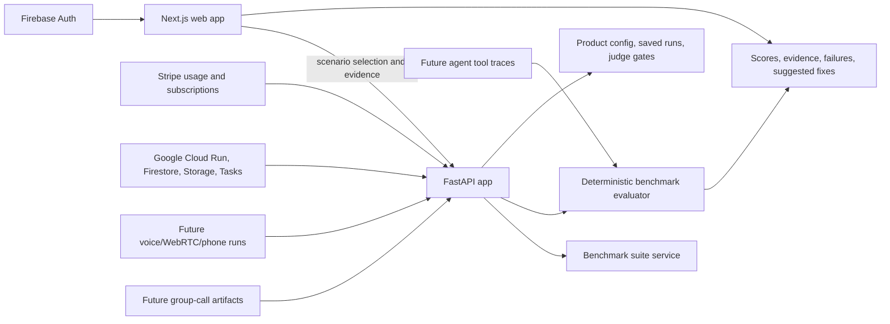

# ConversationAgentEvals

Benchmark conversation, voice, and group-call AI agents end to end, scoring task completion, tool actions, policy compliance, and final outcomes from real evidence.

## What this repo does

- Defines domain benchmark suites for consequential agent workflows.
- Runs scenario tests against conversation evidence: transcript, action/tool trace, and final observed state.
- Scores task completion, required actions, forbidden actions, policy constraints, final-state correctness, and evidence quality.
- Provides a focused benchmark runner UI at `/benchmarks`.
- Exposes a product config API for Free, Starter, Team, and Business gates, including Firebase-ready auth metadata, saved runs, and credit rules.
- Keeps the architecture ready for voice, WebRTC, phone, and group-call evaluation as the product expands.

## Product Direction

Most conversation eval tools grade tone or transcript quality. This project is aimed at a stricter question:

> Did the AI agent actually complete the job?

The MVP starts with text-first scenario simulation and deterministic scoring, then graduates the same benchmark shape to voice AI calls, group calls, tool execution, and vCon-compatible artifacts.

## Pricing And Access Model

- Free: browser transcript evals, deterministic checks, sample benchmarks, local report preview.
- Starter: `$19/month`, unlimited seats, saved projects, custom suites, LLM judge credits, exports.
- Team: `$99/month`, unlimited seats, higher credits, CI/API access, version comparisons, shared audit history, voice/WebRTC access.
- Business: Contact Us for custom integration, readiness assessment, consulting, high-volume evals, phone/SIP, and compliance exports.

Usage is credits/runs-based. Deterministic browser evals are cheap; LLM judging, voice minutes, API/CI runs, persistence, and custom integrations are the paid value.

## Benchmark Families

- Call center voice AI: appointments, cancellations, transfers, interruptions, escalation.
- Telehealth intake: patient routing, privacy boundaries, medication and emergency handling.
- Online teaching: adaptive tutoring, quiz flow, confusion handling, grading boundaries.
- Fintech support: identity checks, disputes, card freezes, fraud escalation, compliance.

## Architecture



Core ownership:

- `apps/web`: Next.js SaaS homepage, benchmark runner, and presentation/demo surfaces.
- `apps/api`: FastAPI backend for sessions, evals, benchmark suites, simulation, and scoring.
- `apps/pipecat`: live media orchestration groundwork for voice/WebRTC paths.
- `docs`: product notes, implementation plan, and benchmark direction.

## Local Setup

```bash
cp .env.example .env
npm run setup
```

Then run the stack:

```bash
npm run dev
```

Or use Docker:

```bash
npm run docker:check
npm run docker:up
```

The Docker path is intended to mirror a production-style container startup:

- `docker compose up --build` builds the API, Pipecat, and web images from the checked-in Dockerfiles.
- Compose starts Postgres first, runs the one-shot `seed` service to create the demo workspace and benchmark projects, then starts the API, worker, Pipecat, and web services behind health checks.
- Containers run the code baked into those images; source directories are not bind-mounted over the built app.
- Local state remains mounted for MVP persistence: `./storage` for generated artifacts and the named `postgres_data` volume for database state.
- The API and worker use the same API image and container-internal `DATABASE_URL` pointed at the `db` service; `.env.example` also includes a localhost `DATABASE_URL` for host-side tools.
- The worker is intentionally lightweight for the MVP: it verifies database connectivity and the seeded benchmark catalog on an interval so Compose exercises the background-process shape before a queue is introduced.
- The web image builds Next.js during `docker build` with compose-provided build args for internal service URLs and browser-facing localhost ports, then starts the prebuilt app at container runtime.
- Compose uses internal service URLs for server-side traffic (`http://api:8000`, `http://pipecat:8110`) and localhost URLs only for browser-facing `NEXT_PUBLIC_*` values.
- `npm run docker:check` is a fast static smoke check for compose defaults, database/worker/seed wiring, and Dockerfile parity. It does not build images or require Docker to be running.
- `npm run test:api` is Docker-first API validation: when Docker is available it builds the checked-in API Dockerfile and runs pytest inside that image, so validation does not depend on host Python virtualenv or ensurepip support. If Docker is unavailable, it falls back to an existing local venv for sandbox-only iteration; use `npm run test:api:docker` to require the hermetic path or `npm run test:api:local` after `npm run setup` for local-only iteration.

Default local endpoints:

- Web app: `http://localhost:3012` with Docker, or the URL printed by `npm run dev`
- API: `http://localhost:8025`
- Pipecat service: `http://localhost:8110`

## Useful Commands

```bash
npm run build:web
npm run test:api
npm run test:api:docker
npm run test:api:local
npm run test:benchmark-smoke
npm run test:e2e
```

`npm run test:benchmark-smoke` is an API-level smoke path for the benchmark runner. It does not need browser or voice credentials; it lists suites, simulates pass and failure runs, verifies run metadata and audit fields, then saves, lists, and exports a run.

Voice proof against a running stack:

```bash
PLAYWRIGHT_BASE_URL=http://127.0.0.1:13000 \
PLAYWRIGHT_API_BASE_URL=http://127.0.0.1:8025 \
PLAYWRIGHT_PIPECAT_BASE_URL=http://127.0.0.1:8110 \
npm run test:voice-proof
```

## Current MVP Boundary

The current product surface is a SaaS homepage plus a focused benchmark runner. The runner can load benchmark suites, simulate a scenario or full suite, inspect transcript/action/final-state/group-call evidence, produce scored benchmark reports, export vCon-compatible records, show pricing gates, request a paid LLM judge gate, and save runs behind a Firebase-ready signup flow.

Near-term next slices:

- Replace in-memory saved runs with Firestore documents scoped by Firebase users/projects.
- Wire Stripe price IDs for Starter and Team.
- Execute LLM judge requests through a provider/Vertex abstraction with spend controls.
- Add voice/WebRTC call artifacts to the same benchmark schema.
- Export vCon-compatible records for voice workflows.
