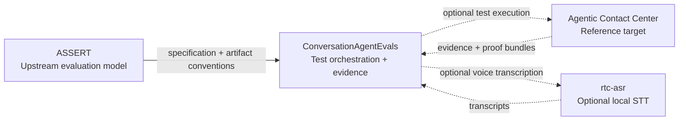
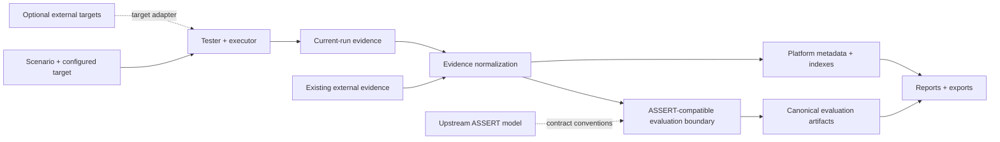

# ConversationAgentEvals

Open-source QA and regression testing for voice and conversation agents, powered by [ASSERT](https://github.com/responsibleai/ASSERT).

ConversationAgentEvals is an application and workflow wrapper around ASSERT-compatible contracts. ASSERT defines the upstream specification, scenario, failure-taxonomy, and portable-artifact model. This repository currently provides the standalone evaluation implementation as well as the product layer around it: target execution, evidence ingestion, projects and runs, queue lifecycle, persistence, reports, exports, and deployment. The ASSERT boundary keeps that local runtime replaceable by an external engine without changing product-facing contracts.

**ConversationAgentEvals is independently installable, testable, and usable.** Its built-in benchmark suites, evidence APIs, ASSERT boundary, reports, exports, and saved-run workflows do not require Agentic Contact Center or another target repository. External systems are optional target adapters and examples, never runtime dependencies of the core product.

There is one product and one supported evaluation contract. Users can either run a configured agent to produce current-run evidence or submit existing evidence from an outside system; both paths converge on the same normalization, evaluation, artifact, and reporting workflow.

## All voice-agent reliability projects

This project is part of the [WebRTC.ventures](https://webrtc.ventures/) open-source voice-agent reliability initiative. The projects remain independently usable and integrate through explicit adapters and evidence contracts:

- [ConversationAgentEvals](https://github.com/agonza1/ConversationAgentEvals) orchestrates tests, normalizes evidence, and reports regressions.
- [Agentic Contact Center](https://github.com/agonza1/agentic-contact-center) is the reference voice-agent target and demonstration.
- [rtc-asr](https://github.com/agonza1/rtc-asr) provides optional local streaming speech-to-text and reproducible ASR benchmarks.
- [ASSERT](https://github.com/responsibleai/ASSERT) remains the upstream evaluation engine.



## Acknowledgment

[Thank you to the ASSERT project and its maintainers](https://github.com/responsibleai/ASSERT) for building and sharing the evaluation foundation this project wraps.

## What this repository adds

- Hosted projects, suites, runs, reruns, comparisons, exports, and audit views.
- Evidence normalization for transcripts, conversations, vCon records, tool/action traces, final-state snapshots, audio pointers, and voice metadata.
- Platform-owned authentication, project lineage, retention, labels, retries, cancellation, quotas, billing hooks, and cost limits.
- Durable ASSERT artifact manifests with searchable platform metadata indexes.
- Operator-facing QA reports, saved-run history, regression comparisons, and export workflows.
- A focused benchmark runner at `/benchmarks`, including an Execute **Launch evaluation** panel that streams conversations into an `inference_set.jsonl` live list for text callables and voice fixtures.
- An opt-in `openai_codex` text target that uses connected local Codex OAuth to record a real model response. It does not invent tool events or completed-task state, so reports honestly show missing live-tool evidence.
- A built-in generalist reference target: Pipecat tester audio → separate Pipecat agent → rtc-asr → configured OpenAI-compatible/Codex LLM → Kokoro → current-run evaluation and vCon evidence. This local synthetic-media proof is not browser, SIP, or PSTN validation.

Evaluation artifacts that conform to the ASSERT boundary remain the canonical results. The application database stores product metadata and indexes; it does not replace the evaluation result model.

## Local development

Prerequisites:

- Node.js 20+
- npm 10+
- Python 3.11+ with `venv`

Install dependencies and create a local environment:

```bash
npm run setup
cp .env.example .env
npm run check:env
```

Start the API, web app, and Pipecat service:

```bash
npm run dev
```

Open the printed web URL and visit `/benchmarks`. The basic demo uses transcript, action-trace, and final-state evidence, so it does not require live microphone ASR or any external target application. Advanced environment settings are documented in [docs/environment.md](docs/environment.md).

Local LLM judge auth (Codex-style OpenAI OAuth, Claude later): [docs/openai-codex-oauth-plan.md](docs/openai-codex-oauth-plan.md).

For the shortest standalone end-to-end walkthrough, see [docs/assert-flow-demo.md](docs/assert-flow-demo.md) or its [machine-readable example](docs/examples/assert-flow-demo.json).

For an **optional external-target example**, see [docs/agentic-contact-center-example.md](docs/agentic-contact-center-example.md). The cancellation-rescue scenario is registered as an optional, individually runnable scenario under `call-center-voice-ai`; it is excluded from the default suite coverage denominator. The example can run entirely offline from a checked-in response fixture or against a separately running Agentic Contact Center service.

Execute-stage **local Pipecat SmallWebRTC audio in/out hooks** with vCon recording/transcription capture (no FreeSWITCH required for CI) are documented in [docs/execution-audio-webrtc.md](docs/execution-audio-webrtc.md).

Standalone offline example after `npm run setup`:

```bash
npm run example:acc:fixture
```

Evaluate that offline fixture through a separately running local ConversationAgentEvals API:

```bash
npm run example:acc:fixture:run
```

The blessed voice-lab proof is also standalone and uses checked-in target-shaped fixtures:

```bash
npm run test:voice-lab-proof
```

The former sibling-repository ACC execution is retained only as an explicit integration command:

```bash
npm run test:voice-lab-proof:acc
```

## Architecture



Core ownership:

- `apps/web`: Next.js product UI and benchmark runner.
- `apps/api`: FastAPI product API, ASSERT boundary, evidence ingestion, persistence, queue lifecycle, and exports.
- `apps/pipecat`: media orchestration groundwork for voice and WebRTC paths.
- `docs`: environment, operations, demos, and product-specific implementation notes.

Canonical ASSERT wrapper anchors:

- [apps/api/app/schemas/assert_contracts.py](apps/api/app/schemas/assert_contracts.py)
- [apps/api/app/services/assert_boundary.py](apps/api/app/services/assert_boundary.py)
- [apps/api/app/services/assert_artifact_store.py](apps/api/app/services/assert_artifact_store.py)
- [apps/api/app/services/assert_queue_lifecycle.py](apps/api/app/services/assert_queue_lifecycle.py)
- [docs/assert-boundary-and-schemas.md](docs/assert-boundary-and-schemas.md)

The primary checked-in runtime evaluates through the local ASSERT-compatible boundary in [apps/api/app/services/benchmark_service.py](apps/api/app/services/benchmark_service.py). The optional `POST /api/assert/runs` endpoint is a synthetic local sidecar adapter used to exercise the same contract. Completed canonical manifests use `local-artifact://assert/runs/{run_id}/manifest.json`.

## Docker

Run the static parity check and start the default API/web stack:

```bash
npm run docker:check
npm run docker:up
```

The default Compose stack uses SQLite at `./storage/conversation_agent_evals.db`. Optional profiles add voice and persistent services:

```bash
docker compose --profile voice up --build

COMPOSE_DATABASE_URL=postgresql://cae:cae_local_password@db:5432/conversation_agent_evals \
  docker compose --profile persistence up --build
```

See [docs/environment.md](docs/environment.md) and [docs/ops-checklist.md](docs/ops-checklist.md) for configuration and deployment details.

## Validation

```bash
npm run check:env
npm run lint:web
npm run build:web
npm run test:api
npm run test:benchmark-smoke
npm run test:voice-lab-proof
apps/api/.venv/bin/python -m pytest apps/api/tests/test_assert_boundary.py apps/api/tests/test_benchmarks.py -q
```

`npm run test:api` uses Docker when available and otherwise falls back to an existing local API virtual environment. Run `npm run setup` first for local-only testing.

## Benchmark families

- Call-center voice AI: appointments, cancellations, transfers, interruptions, escalation.
- Telehealth intake: patient routing, privacy boundaries, medication, and emergency handling.
- Online teaching: adaptive tutoring, quiz flow, confusion handling, grading boundaries.
- Fintech support: identity checks, disputes, card freezes, fraud escalation, compliance.

## Scope

ConversationAgentEvals is the reusable orchestration, evidence, and reporting layer in the WebRTC.ventures open-source voice-agent reliability initiative. It is not a second evaluator competing with ASSERT. Differentiation belongs in target execution, evidence ingestion, report UX, operations, and voice/conversation QA packaging.

## License

Licensed under the [Apache License 2.0](LICENSE).
